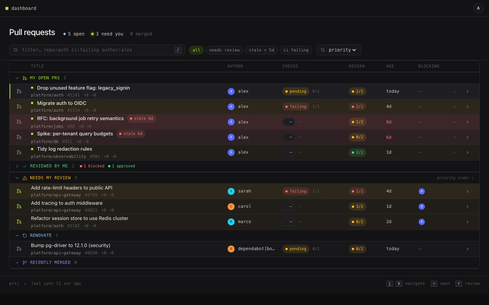

# Dashboard

[](https://github.com/jspdown/dashboard/pkgs/container/dashboard)

A pull request dashboard. A Go API polls GitHub for the PRs you care about and serves a React frontend that groups them by what needs your attention: PRs waiting on your review, your own open PRs, and what merged recently.

No webhooks, no GitHub App. A personal access token with `repo` scope is all it needs.



## Features

- Polls any set of repos, each on its own schedule, so a slow repo never blocks a fast one.
- A configurable review policy (required reviewer count, per-label overrides, ignored labels, bot authors) decides when a PR counts as "needs my review".
- Per-user unread tracking: PRs you have not looked at since they last changed are marked.
- Freshness badges for stale PRs and a "recently merged" group.
- Approval counts and merge-readiness surfaced on every row.

## How it works

- `api/` is a Go service (`dashboard serve`). It polls the GitHub REST and GraphQL APIs, stores PR state in Postgres, and serves both the JSON API and the bundled frontend on `:8080`.
- `app/` is a React 19 + Vite frontend, built into the API image.
- Authentication is delegated to a trusted-header proxy in front of the API (see [Authentication](#authentication)); the API itself runs no OAuth flow.

## Container image

Released images are published to the GitHub Container Registry at [`ghcr.io/jspdown/dashboard`](https://github.com/jspdown/dashboard/pkgs/container/dashboard) (`linux/amd64`). Each `vX.Y.Z` tag push publishes:

| Tag            | Example       | Moves?                            |
|----------------|---------------|-----------------------------------|
| `X.Y.Z`        | `0.1.0`       | no, immutable release             |
| `X.Y`          | `0.1`         | yes, newest patch of that minor   |
| `latest`       | `latest`      | yes, newest release               |
| `sha-<commit>` | `sha-e688982` | no, exact build                   |

Pre-releases (`vX.Y.Z-rc1`) publish only the exact version and its `sha-` tag, no moving `X.Y` or `latest`.

```bash
docker pull ghcr.io/jspdown/dashboard:0.1.0
```

Pin an exact patch tag in production; the example stack does the same (see [`docker-compose.yml`](docker-compose.yml)).

## Quick start

The example stack runs Postgres, the API, and an `oauth2-proxy` in front of it, mirroring the production topology.

1. Register a GitHub OAuth app with the callback URL `http://localhost:4180/oauth2/callback`.
2. Copy `config.example.yaml` and list the repos you want to poll.
3. Provide the secrets (export them, or drop them in a local `.env` next to the compose file):

   ```bash
   export DASHBOARD_GITHUB_TOKEN=...        # PAT with repo scope
   export OAUTH2_PROXY_CLIENT_ID=...
   export OAUTH2_PROXY_CLIENT_SECRET=...
   export OAUTH2_PROXY_COOKIE_SECRET=$(openssl rand -hex 16)
   ```

4. Bring it up:

   ```bash
   docker compose up
   ```

   The example stack pulls a pinned, published image, so no Nix and no local
   build are required. Then open <http://localhost:4180>. To run an image you
   built yourself, see [Local development](#local-development).

To run the API on its own against your own Postgres:

```bash
cd api
go run ./cmd/dashboard serve
```

## Configuration

The repos to poll, the review policy, and the freshness windows live in one YAML file referenced by `--config` (or `DASHBOARD_CONFIG`). See [`config.example.yaml`](config.example.yaml) for the full schema. Connection strings and secrets stay in env vars; authentication has no settings on the dashboard side.

| Flag             | Env var                   | Default | Description                               |
|------------------|---------------------------|---------|-------------------------------------------|
| `--addr`         | `DASHBOARD_API_ADDR`      | `:8080` | HTTP listen address                       |
| `--log-level`    | `DASHBOARD_API_LOG_LEVEL` | `info`  | trace/debug/info/warn/error               |
| `--database-url` | `DASHBOARD_DATABASE_URL`  |         | Postgres DSN (required)                   |
| `--github-token` | `DASHBOARD_GITHUB_TOKEN`  |         | Server PAT with `repo` scope (required)   |
| `--config`       | `DASHBOARD_CONFIG`        |         | Path to the YAML config file (required)   |
| `--web-dir`      | `DASHBOARD_WEB_DIR`       | `/web`  | Built frontend directory (empty disables) |

Each repo must appear once and use a Go duration (`30s`, `5m`, `1h`). The `review` and `freshness` blocks are optional and fall back to defaults.

## Authentication

The dashboard runs no authentication flow of its own. It expects a trusted-header proxy in front that authenticates the user and forwards their identity as the `X-Forwarded-User` header; the `TrustedHeader` middleware reads that header and injects the user into the request context. The example stack uses [oauth2-proxy](https://oauth2-proxy.github.io/oauth2-proxy/), which runs the GitHub OAuth dance and can gate on org membership. The server PAT (`DASHBOARD_GITHUB_TOKEN`) does all GitHub API work and is never tied to a specific user.

Any proxy that can authenticate a request and set `X-Forwarded-User` works; oauth2-proxy is just the one wired into the example.

## Local development

The whole project is a [Nix flake](https://nixos.org): it is the single source of truth for the pinned toolchain (Go, Node, the linters, oauth2-proxy, Chromium), every build, and every check. Install [Nix](https://nixos.org/download) with flakes enabled, then either enter the dev shell with all tools on your `PATH`:

```bash
nix develop
```

or use the forwarding-only `Makefile` aliases, which map 1:1 onto the same flake outputs CI runs (so `make` can never drift from CI). Run `make help` to list them. Prefer Nix directly? Skip `make` and run the `nix` commands yourself.

To iterate on the frontend without registering an OAuth app, the e2e harness runs the whole stack pre-seeded with demo data and stamps the user header for you, with Vite HMR on live frontend source:

```bash
make dev-e2e
```

This starts the API (fake GitHub server + Postgres testcontainer) and Vite with HMR. Open the URL it prints. Requires Docker and Chrome.

To test the container image in the example stack, build it locally and point Compose at it:

```bash
make image                                  # build the x86_64-linux image and docker load it
DASHBOARD_IMAGE=dashboard:<tag> docker compose up
```

`make image` builds the same `x86_64-linux` image CI publishes and loads it into Docker as `dashboard:<short-commit>`; pass that tag to `DASHBOARD_IMAGE`.

## Tests and lint

```bash
make test-unit     # Go unit tests
make test          # unit + e2e tests
make test-e2e      # full e2e suite, Docker + Chrome (nix run .#test-e2e)
make lint          # Go, JS, and shell linters
make check         # the full flake check suite (nix-fast-build .#checks)
make screenshots   # regenerate docs/screenshots via the e2e harness
```

Every check is a flake output, so `make` and CI run exactly the same thing. CI enforces lint, unit tests, the image build, and e2e on every PR.

## License

[MIT](LICENSE)
